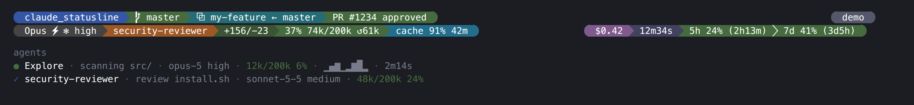

# Claude Statusline

A powerline-style statusline renderer for [Claude Code](https://code.claude.com/docs/en/statusline). It reads session data as JSON from stdin and outputs ANSI-colored, powerline-styled text.



```
 claude_statusline   master  ⧉ my-feature ← master  PR #1234 approved            session-name
 Opus ⚡ ✻ high  security-reviewer  +156/-23  37% 74k/200k ↺61k  cache 91% 42m   $0.42  12m34s  5h 24% (2h13m)  7d 41% (3d5h)
```

The output is two rows: the first says *where* you are working, the second says *how* the session is going. Every section is hidden when its data is absent, so a fresh session in a plain directory renders just the directory and the model.

Each row is split into a left group and a right group pinned to the right edge, so spend and rate limits keep a fixed screen position instead of drifting as the left side grows.

A second binary, `claude_subagent_statusline`, draws the rows of the agent panel below the prompt (the bottom two rows of the screenshot): one per subagent, with its model, context use, recent activity and running time. See [Agent panel](#agent-panel).

## Sections

Each table entry is one section of the example above, listed left to right.

### Row 1 — location

| Section | Example | Color | Description |
|---------|---------|-------|-------------|
| Directory | `claude_statusline` | Blue | Current directory name. Clickable (OSC 8) link to the remote repo when `workspace.repo` is present |
| Git branch | ` master` | Green | Branch you're on: `worktree.branch` when available, otherwise `git branch --show-current` in the workspace directory |
| Worktree | `⧉ my-feature ← master` | Teal | Worktree name (`--worktree` session or linked git worktree), then `←` and the branch it was created from |
| Pull request | `PR #1234 approved` | State-colored | Open PR for the current branch and its review state, clickable. `MR !1234` for a GitLab merge request. Green approved / red changes requested / yellow pending / slate draft |
| Session name | `session-name` | Slate | **Right-aligned.** Only when set with `--name`, `/rename`, or an AI-generated title |
| Update | `↑ v1.0.2` | Orange | **Right-aligned.** Only when a newer release is out, linked to [Install or update](#install-or-update). See [Update check](#update-check) |

### Row 2 — session state

| Section | Example | Color | Description |
|---------|---------|-------|-------------|
| Model | `Opus ⚡ ✻ high` | Gray | Model name, then `⚡` when fast mode is on, `✻` when extended thinking is on, and the reasoning effort level |
| Agent | `security-reviewer` | Orange | Agent the session runs as (`--agent` or agent settings) |
| Lines changed | `+156/-23` | Olive | Lines added and removed during the session |
| Context | `37% 74k/200k ↺61k` | Green / Yellow / Red | How full the context window is, tokens used out of its size, and `↺` tokens the last request read from the prompt cache. A `200k+` marker appears past 200k tokens |
| Prompt cache | `cache 91% 42m` | Cyan / Yellow / Slate | Warm: share of this session's input served from the cache, and minutes until it expires (seconds in the last minute); yellow in the last fifth of its TTL. Needs `refreshInterval` to count down while idle. After a request that missed the cache, `miss: tools changed` names the likely cause until the next request. Cold: `cache cold ↻45k`, the tokens your next message re-caches. Hidden when caching isn't observed. Can also [notify you](#cache-expiry-notification) before it expires |
| Cost | `$0.42` | Purple | **Right-aligned.** Estimated session cost in USD (hidden below $0.01) |
| Duration | `12m34s` | Indigo | **Right-aligned.** How long the session has been running |
| 5-hour limit | `5h 24% (2h13m)` | Green / Yellow / Red | **Right-aligned.** Share of the 5-hour subscription limit used, and time until it resets |
| 7-day limit | `7d 41% (3d5h)` | Green / Yellow / Red | **Right-aligned.** The same for the 7-day limit |
| Spend limit | `spend 63% (12d0h)` | Green / Yellow / Red | **Right-aligned.** Not in the example: appears only behind a Claude apps gateway that sets a spend limit. Spend so far out of the limit (`spend $271/$500`), or the share used when the gateway doesn't report dollars, and time until it resets. Colored by the share used, which can pass 100% |

Threshold colors for context and rate limits:
- **Green** -- 0-59%
- **Yellow** -- 60-80%
- **Red** -- above 80%

### Agent panel

`claude_subagent_statusline` replaces the body of each subagent row in the agent panel below the
prompt:

```
● Explore · scanning src/ · opus-5 high · 12k/200k 6% · ▁▄▆▁▂▆█▂ · 2m14s
✓ security-reviewer · review install.sh · sonnet-5-5 medium · 48k/200k 24%
```

Each table entry is one column of the first row, listed left to right. Columns are separated by
`·` and hidden when their data is absent.

| Column | Example | Color | Description |
|--------|---------|-------|-------------|
| Status | `●` | State-colored | Green `●` running, yellow `○` pending, blue `✓` completed, red `✗` failed or killed, slate `●` anything else, such as paused |
| Name | `Explore` | White | Name the subagent was spawned with. Most subagents have none and show their task description instead, such as `Search the repo` |
| Detail | `scanning src/` | Dim | What the subagent is doing now, or its task description when the name doesn't already show it. Truncated with `…` to the room left, and dropped when less than 8 cells remain |
| Model | `opus-5 high` | Dim | Model ID without the `claude-` prefix and date suffix, then the effort set for that subagent: a level, or a token budget such as `16k` |
| Context | `12k/200k 6%` | Green / Yellow / Red | Tokens in the subagent's context out of its model's window, and the share used, with the same thresholds as the main context. Only the token count, dimmed, when the window size is unknown. Hidden until the subagent reports tokens |
| Activity | `▁▄▆▁▂▆█▂` | Dim | **Running only.** Tokens gained in each of the last eight refresh intervals (about five seconds each), scaled to the busiest one. A flat `▁▁▁` is a subagent that has stopped producing tokens, for example while a long tool call runs |
| Running time | `2m14s` | Dim | **Running only.** How long the subagent has been running. A finished subagent doesn't report when it ended, so it gets neither this column nor the activity |

A row never wraps. Claude Code reports the width left for the row body, and the name, model and
context always show, the name truncated if they wouldn't fit otherwise. Running time, then
activity, are added only if they fit while leaving 8 cells for the detail, which then fills
whatever is left.

### Right alignment

Claude Code captures the script's stdout, so `tput cols` cannot see the terminal. It exports
`COLUMNS` and `LINES` instead (v2.1.153+), and the renderer pads between the two groups to push
the right one against the edge. Widths are measured in terminal cells with `unicode-width`, not
bytes or chars, so the powerline glyphs and emoji markers line up.

It degrades rather than wraps. When the two groups would collide on a narrow terminal, they join
into one continuous powerline with no padding. When even that doesn't fit, sections are dropped,
least useful first, until the row fits, instead of Claude Code clipping whatever reaches the right
edge:

- **Row 1:** session name, update notice, worktree, pull request, then git branch. The directory
  always stays.
- **Row 2:** lines changed, duration, agent, cost, 7-day limit, prompt cache, spend limit, 5-hour
  limit, then context. The model always stays.

Sections go strictly in that order: none is hidden while one earlier in its list still shows. When
`COLUMNS` is unset, the width is unknown, so the row renders whole as one continuous powerline.

`COLUMNS` is the full terminal width, but Claude Code draws the status line inside its own chrome
and truncates whatever overflows, so five cells are held back from the right edge. Change that with
`CLAUDE_STATUSLINE_RIGHT_MARGIN` -- raise it if the right group still gets clipped, lower it if the
gap looks too wide:

```json
{ "env": { "CLAUDE_STATUSLINE_RIGHT_MARGIN": "7" } }
```

To move a section between sides, move its `Section::new(...)` push between the `sections` and
`right` vectors in `location_sections` / `session_sections` in `src/main.rs`. The drop order is the
`priority` module next to them.

### Update check

Once a day, the status line checks GitHub for a newer release and, when there is one, shows
`↑ v1.0.2` at the right of the first row, linked to [Install or update](#install-or-update).
Nothing is installed automatically.

The check never slows the status line down. Each render only reads the tag cached in
`~/.claude/claude_statusline.update` (`$CLAUDE_CONFIG_DIR` when set). When that file is a day old,
the render starts a detached `claude_statusline --check-update`, which follows the
`/releases/latest` redirect with `curl`, as `install.sh` does, and writes the tag back. A failed
check waits a day before the next try.

To turn it off, set `CLAUDE_STATUSLINE_UPDATE_CHECK` to `0`. It is also off when
`CLAUDE_CODE_DISABLE_NONESSENTIAL_TRAFFIC` is set.

```json
{ "env": { "CLAUDE_STATUSLINE_UPDATE_CHECK": "0" } }
```

### Cache expiry notification

The status line can raise a desktop notification shortly before the prompt cache expires, so you
can send a message while it is still warm instead of paying to re-cache the whole conversation.
It is off by default. Set `CLAUDE_STATUSLINE_CACHE_NOTIFY` to the lead time, in minutes:

```json
{ "env": { "CLAUDE_STATUSLINE_CACHE_NOTIFY": "10" } }
```

The notification reads `Prompt cache expires in 10m`, followed by the session name (or the
directory) and the tokens the next message re-caches once the cache is cold. It goes through
`notify-send` on Linux and `osascript` on macOS, started detached so the render never waits for it.

- It needs `refreshInterval` (see [Configure Claude Code](#configure-claude-code)). The cache runs
  out while you're idle, when nothing else redraws the status line.
- It fires once per session each time the cache nears expiry. Every request moves the expiry, which
  re-arms it. Each notification leaves a marker in `~/.claude/claude_statusline.cache-notify/`
  (`$CLAUDE_CONFIG_DIR` when set), removed once its cache has expired.
- The lead time must be shorter than the cache TTL. With a 5-minute TTL, use 1 to 4 minutes;
  longer lead times never fire.
- It shows on the machine running Claude Code, so it won't reach you through SSH.

## Requirements

- Rust 1.88+
- A terminal with true color (24-bit) support
- A [Nerd Font](https://www.nerdfonts.com/font-downloads) (e.g. MesloLGS NF, JetBrains Mono Nerd
  Font), or Symbols Nerd Font Mono as a fallback font. Ghostty, WezTerm and Kitty 0.36+ ship these
  glyphs built in. Plain "for Powerline" fonts are not enough: they lack the rounded end caps
  (U+E0B4, U+E0B6).
  - The worktree marker `⧉` (U+29C9) is missing from most Nerd Fonts and falls back to a math font
    such as Noto Sans Math.
  - The fast mode marker `⚡` looks best with an emoji font such as Noto Color Emoji.
- Clickable PR and repo links need a terminal with OSC 8 support (Ghostty, iTerm2, Kitty, WezTerm)
- The update check needs `curl`

## Build

```sh
cargo build --release
```

Two binaries are produced in `target/release/`:

- `claude_statusline` -- the main status line
- `claude_subagent_statusline` -- one row per subagent in the agent panel

## Install or update

```sh
curl -fsSL https://raw.githubusercontent.com/gdarmont/claude_statusline/master/install.sh | bash
```

Detects your platform, downloads the matching zip from the latest release, verifies it against the
published `SHA256SUMS`, backs up any existing `claude_statusline` to `claude_statusline.bak` on
first run, and installs both binaries into `~/.claude/`. Prebuilt binaries cover x86_64 and
aarch64 Linux (static musl; aarch64 from v1.2.0) and both Apple Silicon and Intel
macOS; anything else needs a source build.

To update, run the same command again. Claude Code switches to the new version on its next status
line refresh, without a restart. What changed in each version is on the
[releases page](https://github.com/gdarmont/claude_statusline/releases).

It then sets up `settings.json`, asking first:

- The two optional features: the [cache expiry notification](#cache-expiry-notification), off by
  default, and the daily [update check](#update-check), on by default. Every answer is saved in the
  `env` block, a no included, so updates don't ask again. A setting already in `settings.json` or in
  the environment is never asked about.
- The [`statusLine` and `subagentStatusLine` blocks](#configure-claude-code), when they don't run
  the installed binaries yet, or `refreshInterval` when the status line runs without it. It lists
  the changes before applying them. If `settings.json` already runs another status line, it shows
  that command and replaces it only if you answer yes.

It writes every change at once with `jq`, after copying the file to
`settings.json.claude_statusline.bak`, and writes through a symlinked `settings.json` rather than
replacing it. Without `jq`, without a terminal, or when `settings.json` isn't valid JSON, it leaves
the file alone and prints what to add instead.

To run only this setup again, for the binaries already installed, pass `--settings-only`:

```sh
curl -fsSL https://raw.githubusercontent.com/gdarmont/claude_statusline/master/install.sh \
  | bash -s -- --settings-only
```

| Variable | Default | Purpose |
|----------|---------|---------|
| `CLAUDE_DIR` | `~/.claude` | Install directory |
| `VERSION` | latest release | Pin to a specific tag, e.g. `v0.9.0` |
| `NONINTERACTIVE` | unset | `1` skips the questions and leaves `settings.json` alone, printing what to add instead, as happens with no terminal |

```sh
curl -fsSL https://raw.githubusercontent.com/gdarmont/claude_statusline/master/install.sh \
  | VERSION=v0.9.0 CLAUDE_DIR=/opt/claude bash
```

### From source

```sh
./dev-install.sh
```

Builds both binaries in release mode, installs them the same way, smoke-tests what landed, and
then runs `./install.sh --settings-only` to set up `settings.json`. Or by hand:

```sh
cargo build --release
cp target/release/claude_statusline target/release/claude_subagent_statusline ~/.claude/
```

To check what's installed:

```sh
~/.claude/claude_statusline --version
```

Release zips and the binaries in them carry a signed build provenance attestation (v1.2.0 and
later). To confirm a binary was built by this repository's release workflow, with the
[GitHub CLI](https://cli.github.com/) logged in:

```sh
gh attestation verify ~/.claude/claude_statusline --repo gdarmont/claude_statusline \
  --signer-workflow gdarmont/claude_statusline/.github/workflows/release.yml
```

`--signer-workflow` accepts only signatures made by `release.yml`, not by other workflows in the
repository.

## Uninstall

```sh
curl -fsSL https://raw.githubusercontent.com/gdarmont/claude_statusline/master/uninstall.sh | bash
```

Removes both binaries from `~/.claude/` with their `.bak` backups, the
[update check](#update-check)'s cache and the [cache notification](#cache-expiry-notification)'s
markers. From `settings.json`, it removes the `statusLine` and `subagentStatusLine` blocks when
they run `claude_statusline`, from `~/.claude/` or a source build, and every `CLAUDE_STATUSLINE_*`
entry in the `env` block. A status line that runs another command is left alone.

It lists all of it and asks before removing anything. It edits `settings.json` the way `install.sh`
does, with `jq`, after copying it to `settings.json.claude_statusline.bak`. Without `jq`, or when
`settings.json` isn't valid JSON, it removes the files and prints what to delete from
`settings.json` by hand. Restart Claude Code afterwards.

| Variable | Default | Purpose |
|----------|---------|---------|
| `CLAUDE_DIR` | `~/.claude` | Install directory, as given to `install.sh` |
| `NONINTERACTIVE` | unset | `1` removes everything without asking, as happens with no terminal |

## Releasing

Releases are built by [`.github/workflows/release.yml`](.github/workflows/release.yml) when a `v*`
tag is pushed. Bump `version` in `Cargo.toml` first -- the workflow refuses to build when the tag
and the crate version disagree.

```sh
cargo build --release   # refresh Cargo.lock, which CI installs with --locked
git commit -am "Release v1.0.1"
git tag -a v1.0.1 -m "v1.0.1"
git push origin master --follow-tags
```

The workflow runs the full CI suite first and builds nothing unless it passes. Each platform job
then zips both binaries together, and the release job publishes every zip plus a `SHA256SUMS` file.
The release notes list the commit subjects since the previous tag, leaving out the `Release vX`
commits, so write subjects that read as changelog entries. Once the release is out, an install job
runs `install.sh` on x86_64 and arm64 Linux and on Apple Silicon macOS, the way users do, and checks
that the installed version matches the tag.

In this repository, a `Release tags` ruleset blocks deleting or moving a `v*` tag once it's pushed,
so fix a bad release with a new patch version. To move a tag anyway, disable the ruleset in the
repository's Settings → Rules first.

To rehearse a release without publishing, for example after changing the workflow, run it by hand.
It tests, builds and packages every platform, then stops before creating the release:

```sh
gh workflow run release.yml --ref master
```

## Configure Claude Code

`install.sh` offers to set this up. To do it by hand, in `~/.claude/settings.json`:

```json
{
  "statusLine": {
    "type": "command",
    "command": "~/.claude/claude_statusline",
    "padding": 0,
    "refreshInterval": 15
  },
  "subagentStatusLine": {
    "type": "command",
    "command": "~/.claude/claude_subagent_statusline"
  }
}
```

Restart Claude Code for the change to take effect.

`refreshInterval` re-runs the status line every 15 seconds on top of Claude Code's own triggers,
which fire on events such as a new message or `/compact`, and once when the prompt cache expires or
a rate limit resets. Without it, the countdowns freeze while you're idle: the cache shows the time
left at your last message until it turns cold, and never turns yellow or
[notifies you](#cache-expiry-notification) as it nears expiry, which is exactly when you'd want to
know. The binary finishes in a few milliseconds, so the cost is negligible.

`subagentStatusLine` takes no `refreshInterval`. Claude Code runs it shortly after a subagent
appears in the agent panel or leaves it, then every five seconds while any is shown, and that tick
is what the activity sparkline measures.

## Input format

Both schemas below were last checked against Claude Code **v2.1.291**. Newer releases add fields
the renderer ignores, and a field whose type changes hides its section instead of breaking the line.

To see what a newer Claude Code changed, run `python3 docs/check_schema.py`. It reads both payloads
from the installed `claude` binary and diffs them against
[`docs/claude-code-payloads.txt`](docs/claude-code-payloads.txt), the full schemas as last checked.
Once the renderer and this README handle the changes, `--update` records the new version in both.

Claude Code pipes a JSON object to stdin on every refresh. Every field below is optional except `workspace.current_dir` and `model.display_name`:

```json
{
  "session_id": "4b1c6f0e-8d2a-4f5b-9c3e-7a1d2e3f4a5b",
  "session_name": "my-session",
  "model": { "display_name": "Opus" },
  "workspace": {
    "current_dir": "/home/user/projects/myproject",
    "git_worktree": "feature-xyz",
    "repo": { "host": "github.com", "owner": "anthropics", "name": "claude-code" }
  },
  "cost": {
    "total_cost_usd": 0.42,
    "total_duration_ms": 754000,
    "total_lines_added": 156,
    "total_lines_removed": 23
  },
  "context_window": {
    "total_input_tokens": 74500,
    "context_window_size": 200000,
    "used_percentage": 37.2,
    "current_usage": { "cache_read_input_tokens": 61000 }
  },
  "exceeds_200k_tokens": false,
  "fast_mode": true,
  "effort": { "level": "high" },
  "thinking": { "enabled": true },
  "rate_limits": {
    "five_hour": { "used_percentage": 23.5, "resets_at": 1738425600 },
    "seven_day": { "used_percentage": 41.2, "resets_at": 1738857600 },
    "spend_limit": {
      "used_percentage": 62.8, "resets_at": 1740787200, "used_usd": 271.4, "limit_usd": 500
    }
  },
  "prompt_cache": {
    "warm": true,
    "caching_observed": true,
    "ttl": "1h",
    "expires_at": 1738429200,
    "hit_ratio": 0.91,
    "recache_tokens_if_cold": 45000,
    "last_miss_at": 1738420000,
    "last_miss_cause": { "causes": ["tools_changed"] }
  },
  "agent": { "name": "security-reviewer" },
  "pr": { "number": 1234, "url": "https://github.com/o/r/pull/1234", "review_state": "approved" },
  "worktree": { "name": "my-feature", "branch": "worktree-my-feature", "original_branch": "main" }
}
```

Notes on availability:

- `rate_limits` appears for Claude.ai Pro/Max subscribers after the first API response. `spend_limit` appears only behind a Claude apps gateway that sets one (v2.1.251+). Its `used_usd` and `limit_usd` need v2.1.284+ on both Claude Code and the gateway, and can lag `used_percentage` by about five minutes
- `prompt_cache` appears after the main conversation's first API response (v2.1.251+). `expires_at` is `null` while the cache is cold. `last_miss_cause` needs v2.1.260+
- `pr` appears only while an open PR or GitLab merge request exists for the branch. `kind` is `mr` for a merge request and absent for GitHub (v2.1.234+)
- `effort` appears only on models supporting the reasoning effort parameter
- `context_window.current_usage` is `null` before the first API call and after `/compact`

### Subagent rows

`claude_subagent_statusline` receives every visible subagent row at once and writes one
`{"id": ..., "content": ...}` line per row (see [Agent panel](#agent-panel) for what it draws).
Every field is optional except `id`:

```json
{
  "session_id": "4b1c6f0e-8d2a-4f5b-9c3e-7a1d2e3f4a5b",
  "cwd": "/home/user/projects/myproject",
  "columns": 80,
  "tasks": [
    {
      "id": "t1", "name": "Explore", "type": "local_agent", "status": "running",
      "label": "scanning src/", "description": "Search the repo",
      "model": "claude-opus-5", "effort": "high", "contextWindowSize": 200000,
      "tokenCount": 12500, "startTime": 1738425466000,
      "tokenSamples": [0, 0, 500, 1500, 1500, 1600],
      "cwd": "/home/user/projects/myproject"
    }
  ]
}
```

Notes on availability:

- The payload also carries the [common hook fields](https://code.claude.com/docs/en/hooks#common-input-fields)
  such as `session_id` and `transcript_path`. The renderer ignores them, along with `type` and each
  task's `cwd`
- `columns` is the width left for the row body once Claude Code has drawn its own indent
- `name` is set only for a subagent given a name when it was spawned, so that other agents can
  message it. The others are titled by their `description`
- `status` is `pending`, `running`, `completed`, `failed`, `killed` or `paused`
- `label` is what the subagent reports doing now, and falls back to `description`
- `tokenCount` is `0` until the subagent reports progress. `tokenSamples` holds its value at each of
  the last 16 refresh ticks, oldest first. `startTime` is in Unix milliseconds
- `model` and `contextWindowSize` need v2.1.205+, and are absent until the subagent's model is
  resolved. `effort` needs v2.1.214+, and is absent when the subagent inherits the session's effort

A task missing from the output keeps Claude Code's default row (`name · description · token
count`), and so does every task when the command fails or takes more than five seconds.

## Testing

```sh
cargo test
```

Unit tests sit next to the code in each binary. `tests/cli.rs` runs the built binaries end to
end, JSON on stdin, the way Claude Code does. CI runs formatting, clippy with warnings as errors,
and the tests on Linux and macOS, plus a build on the `rust-version` from `Cargo.toml`.

A field whose type changes in a new Claude Code release is treated as absent, so only its section
disappears. If the whole line shows `[statusline]` instead, the payload itself couldn't be parsed;
the reason is on stderr, which `claude --debug` logs. The subagent binary prints nothing in that
case, so the agent panel falls back to Claude Code's default rows, and a single task it can't
parse keeps its default row while the others still render.

To try a payload by hand:

```sh
echo '{"workspace":{"current_dir":"/tmp/demo"},"model":{"display_name":"Opus"}}' \
  | ./target/release/claude_statusline

echo '{"columns":80,"tasks":[{"id":"t1","name":"Explore","status":"running","tokenCount":12500,"contextWindowSize":200000}]}' \
  | ./target/release/claude_subagent_statusline
```

The screenshot at the top comes from the release binaries too. After a visual change, regenerate it
with `python3 docs/screenshot.py` (needs `cargo build --release`, the MesloLGS NF font, and Chrome
or Chromium).

## License

Licensed under the [Apache License 2.0](LICENSE).
